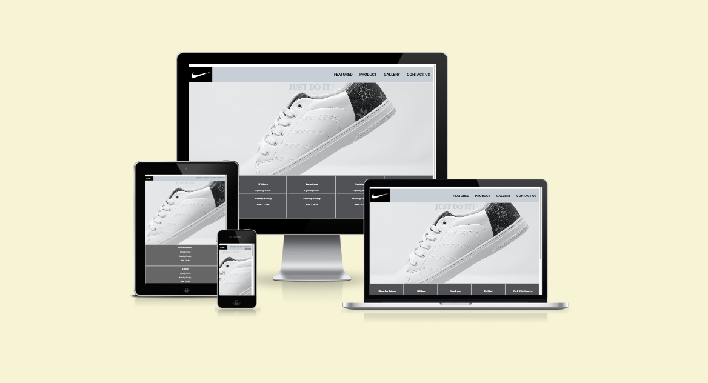

# First Project

This is a simple website created as part of a coding project. The purpose of this project is to demonstrate proficiency in HTML, CSS, and.

## Table of Contents

## Introduction
## Features
## Languages Used
## Frameworks, Libraries & Programs Used
## Testing
## Deployment
## Credits
## acknowledgments

## Introduction

This website was created as a learning project to practice web development skills. The website is a  simple 4 page design with a responsive layout that adjusts to different screen sizes.

The website includes a Featured page, a product page, a Gallery page and a  Contact Us page. The Featured page provides a brief overview of the website. The Product page showcases some sample products with price, purchase options and images. The Gallery page provides some sample photos of the new products and what what can be found on this brands website. The contact page includes a form where visitors can submit their contact information.

## Features

The website includes the following features:

- Responsive layout that adjusts to different screen sizes
- Navigation menu
- Contact form with validation to ensure all fields are filled out correctly
- Success message that displays after the contact form is submitted

## Languages Used

- HTML
- CSS

## Frameworks, Libraries & Programs Used

-Hover.css

	- Hover were used on navigation menu to change the color of text.
	- Hover effect were used on Gallery page to pop-up the image.
	- Hover were used on product page on buttons ”More Details” to change the color.
	- Hover were used on button one Contact Us page on “Submit” Button.
	- On Footer on all pages, on social media links pointer changes while hovering. 

- Google Fonts:

  - Google fonts were used to import the "Roboto" font into the style.css file which is used on all pages throughout the project.

- Font Awesome

  - Font Awesome was used on all pages throughout the website to add icons for aesthetic and UX purposes

- GitHub:

  - GitHub is used to store the projects code after being pushed from Git.

# Testing

	- W3C CSS Validator
	- W3C Markup Validator.

## Deployment

The project was deployed to GitHub Pages using the following steps...

1. Log in to GitHub and locate the GitHub Repository
2. At the top of the Repository (not top of page), locate the "Settings" Button on the menu.
3. Scroll down the Settings page until you locate the "GitHub Pages" Section.
4. Under "Source", click the dropdown called "None" and select "Master Branch".
5. The page will automatically refresh.
6. Scroll back down through the page to locate the now published site link in the "GitHub Pages" section.

## Credits

- Content
  - All content was Written by Developer

- Media
  - Medias were downloaded from Unsplash.com and pexels.com

## acknowledgments

	- Thanks to my mentor for helpful feedback.
	- Tutor support at Code institute for their support.
	- Slack community for their support.  
